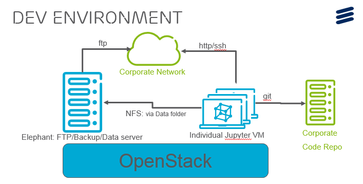

Part of my task in the Data Science Team is to participate in the deployment of our development environment. This will be the first, of a series of articles about the environment we use at work.

## Requirements

Like any other team we have some requirements. It would be super nice to do anything we want but it’s not realistic. We come with an enterprise reality where some requirements are imposed by the company. There is politics involve in terms of which product we can and can’t buy, or with which supplier we can and can’t deal with.

Here is some of the hard requirements we have to deal with:

* Data Sovereignty: Data is either own by us or by our customers. Depending on the project, we have specific requirements on the data. Going from data must stay on our server in this specific country to upload it wherever you like. So our solution must match both reality.
* Tool-set: We are a fairly small team, but we do not all uses the same tools, and not even the same languages for our analysis (some uses R and others uses Python).
* Collaboration: We want to be able to share code and analysis between team members.
* Libraries: We are still finding new libraries. We want a system that allows us to install and update open source libraries.

## Solution

After some experiments we have decided to build our own environment platform. We really wanted a platform that we could deploy on demand on anybody’s infrastructure regardless if it’s physical or virtual, public or private. As long as it’s easily deployable on a Linux server.

Each of us (data scientist) have their own VM. These VM contains the following setup:

* Linux OS (Debian or Ubuntu)
* Python3
* R
* [Jupyter Notebook](http://jupyter.org/)
  * Git custom Add-on
* Open Source Libs
* Export script
* Data Share Drive

## Setup details

To develop we use Jupyter, a very well-known tool in data science. The best way to describe it would be a Web IDE for interpreted languages. It is currently configured to work with R and Python 3. To work efficiently between data scientist we have developed a Jupyter Extension that allows us to share code between all our VM. I will provide more details about this Extension in another blog entry. This extension save and share our source files (Jupyter file) on a Git repository. The data itself is stored on a shared drive that all VMs have access to.

I will add the list of used libraries at the end of this article. We also have an export script. This script allows us to export the Jupyter files when we work on customer’s servers. This script makes sure to strip out any data from the source file so we can export them with no problems back to our office.

## Installation Procedure

To deploy this environment we have a simple script that takes care of installing all the software, connecting the data share drive, installing the Jupyter extension downloading existing code. There is also an update script that grab and install the latest version of the open source libraries.

## Development VM size

Each of our development virtual machines are:

* CPU: 8 Cores
* RAM: 16 GB
* HDD: 160 GB

These VMs run on top of an OpenStack cluster. Because our install script does not communicate with the OpenStack APIs we could easily deploy on any other platform.

## Data Share Server

To host and exchange data between these VMs we have setup this Data Server. This server is hosting all our data during our project. It is composed of an FTP server, for customers to send or receive data, an [NFS](https://en.wikipedia.org/wiki/Network_File_System) drive to do the actual file sharing and a backup solution to make sure we don’t lose precious data.

## Open Source Libraries

Here is the exhaustive list of library we use. Keep in mind these gets updated frequently.

**System Lib (apt-get):** libperl-dev – python3-cairo – libxml2-dev – libsnappy-dev – aptitude – python3-pip – python3-dev – build-essential – libcurl4-openssl-dev – python3-pandas – libperl-dev – libxml2-dev – libssl-dev – r-base – r-base-dev – git – tmux

**Pip 3 (Python3 Libs) :** GitPython – jupyter – numpy – scipy – pandas – xlrd – scikit-learn – parquet – sklearn – geopy – seaborn – folium – ipython-autotime – beautifulsoup4 – openpyxl – lxml – python-igraph – ipython-autotime – tqdm

**R:** repr – IRdisplay – evaluate – crayon – pbdZMQ – devtools – uuid – digest – IRkernel/IRkernel – ggplot2 – plyr – caret – kernlab – MASS – igraph

## Conclusion

This is a quick overview of the platform we built. This is in constant evolution and because we are using our own solution we can update it with our needs.

Coming: Part-2 Details around this Jupyter Extension
