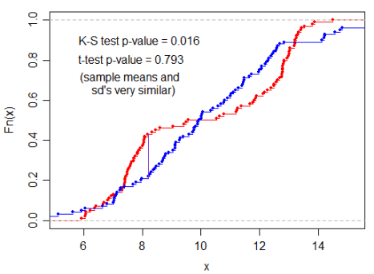
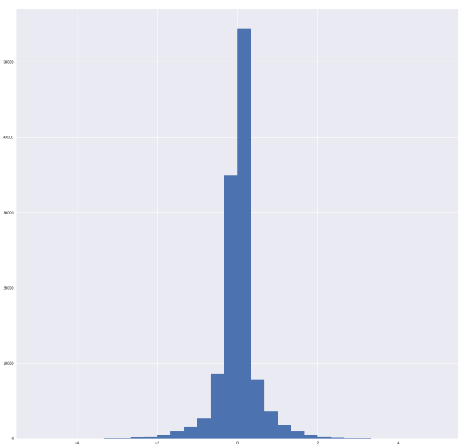
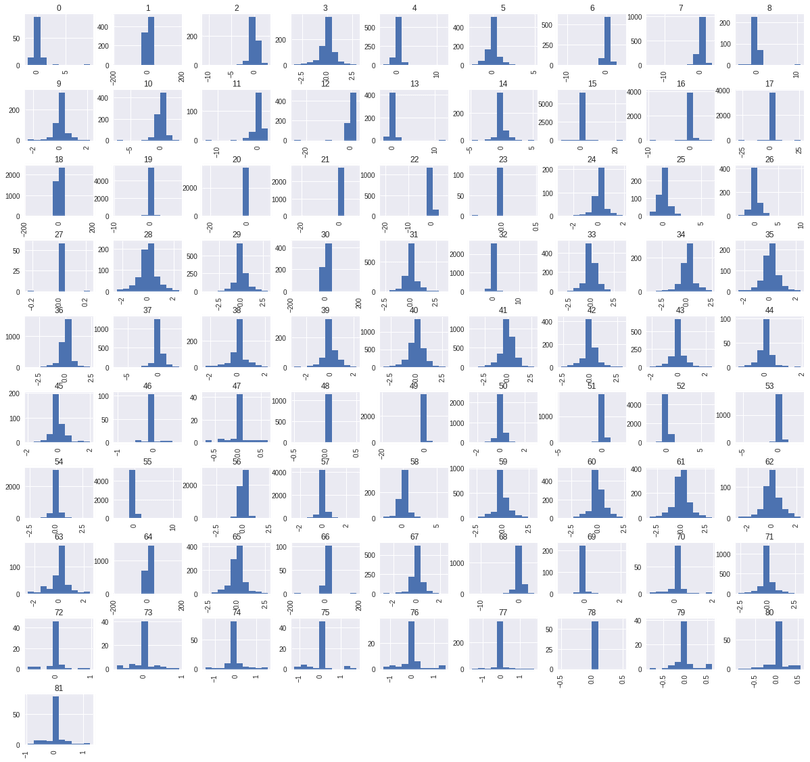
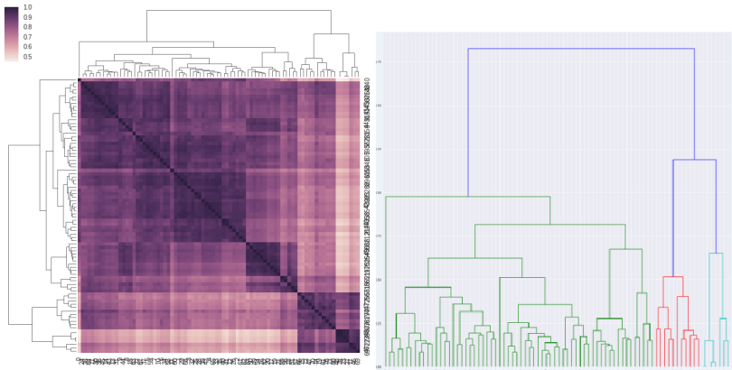
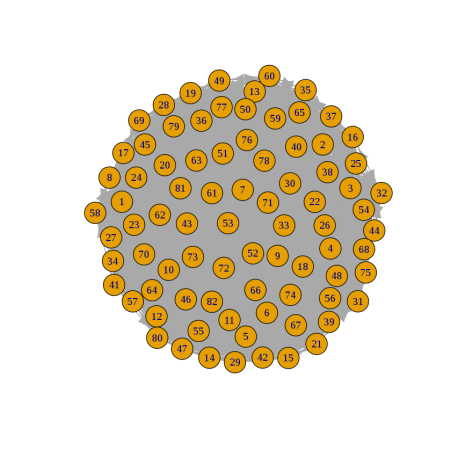
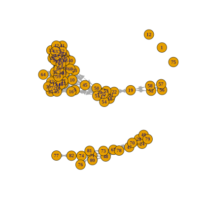

Lately, at work, we had to do a lot of unsupervised classification. We basically had to distinguish N classes from a sample population. We had a rough idea of how many classes were present but nothing was sure, we discovered the [Kolmogorov–Smirnov test](https://en.wikipedia.org/wiki/Kolmogorov%E2%80%93Smirnov_test) a very efficient way to determine if two samples are significantly different from each other.

I will give you a bit of context on the Kolmogorov–Smirnov test and walk you though one problem we solved with it.

## A bit of theory

_Rejecting the null hypothesis._ That sounds like a painful memory from university statistic class, but it’s actually exactly what we want to do here. We want to reject the possibility that the two samples are coming from the exact same distribution. Let’s look at a very high level, non-mathematical, overview of some tests available. If you want to get a good understanding of the mathematics behind all these tests, use the Wikipedia link provided in all the sections.

## Student’s T-Test

The [Student’s T-Test](https://en.wikipedia.org/wiki/Student%27s_t-test) is probably the most well know way of rejecting the null hypothesis. This test calculate the P-value of a sample vs a normal population or vs another sample. The result, P-value, tells you how likely these samples comes from the exact same distribution.

When obtained, the P-Value can be compared with a threshold call statistical significance (e.g. .05), if the P-Value is smaller, we can reject the null hypotheses.

There is an issue with Student’s T-Test, samples must be normal (shaped in a normal distribution). That is an issue for us because we do work a lot with Poisson distributions.

## Kolmogorov–Smirnov test

The [Kolmogorov–Smirnov test](https://en.wikipedia.org/wiki/Kolmogorov%E2%80%93Smirnov_test) (KS Test) is a bit more complex and allows you to detect patterns you can’t detect with a Student’s T-Test.

From Wikipedia: _“The Kolmogorov–Smirnov statistic quantifies a distance between the_[ empirical distribution function](https://en.wikipedia.org/wiki/Empirical_distribution_function)_ of the sample and the _[cumulative distribution function ](https://en.wikipedia.org/wiki/Cumulative_distribution_function)_of the reference distribution, or between the empirical distribution functions of two samples.”_

Here is an example that shows the difference between Student’s T-Test and KS Test taken from stackexchange.com.

Because the sample mean and standard deviation are highly similar the Student’s T-Test gives a very high p-value. KS Test can detect the variance. In this case the red distribution has a slightly binomial distribution which KS detect. In other words:

* Student’s T-Test says that there is **79.3%** chances the two samples come from the same distribution.
* KS Test says that there are **1.6%** chances the two samples come from the same distribution.

## Other tests

There are many other Test and algorithms to do that type of work. The [Shapiro–Wilk test](https://en.wikipedia.org/wiki/Shapiro%E2%80%93Wilk_test) ~~and the [Anderson–Darling test](https://en.wikipedia.org/wiki/Anderson%E2%80%93Darling_test) ~~are two tests considered more powerful than the KS Test. There is a major downside with these two tests, they don’t allow you to compare two samples, they always compare a sample with a standard distribution.

_Edit: A colleague of mine showed me that Anderson-Darling could also be used for two way testing (Comparing Samples)._

> ”The two-sample K–S test is one of the most useful and general non-parametric methods for comparing two samples” – Wikipedia.

## Detect Device User

For this specific assignment we had to detect which user was using a specific device. Each device was used by one or many different users and we had to come up with a technique to identify if there were one or multiple users. In the case of multiple users we wanted to identify which usage was done by which user.

## Our Strategy

We decided to use a mix of graph network and KS Test to identify potential clusters. The idea behind this demo is to imagine a graph network where every node (sample) was connected to every other node (sample). The vertices or link between these nodes would me _KS Test_, in other words, how close are these two nodes. So two nodes with low KS P-Value would be close and two with High P-Value would be far. This hopefully would create distinguishable clusters.

## Data set

Here is what our data looks like:

As you can see, all our sample looks like a normal distribution with a very low standard deviation. We have sampled all the 82 different usage sessions of this device.

Strait from this picture we can see that there are different patterns. All the sample does not have the same histogram distribution. That is a very good start. After this we looked at the obvious cluster of distribution.

To do so, we did the KS matrix, which consists of a KS Two way test of every sample distribution vs every other sample.A quick view of the KS Matrix heat map does not reveal obvious results (As you can see on the figure on your right).

After so hierarchical clustering, we already get some better results.(As you can see on the following figure.)

In these two dendrogram visualization, we can see some potential (3) clusters. After review these clusters came back to be insignificant.

## Network Graph

After the unsuccessful dendrogram clustering, we tried the proposed Graph approach. The goal here, like explained earlier, is to graph all the possible nodes and vertices. The vertices length being the KS Test Value. We had to remove the self-reference (which was always 0 (obviously you are perfectly similar to yourself).

We then ended up with a network graph where everybody was connected with everybody else which is not particularly useful.

The next step is to only keep the significant link (lower than a certain threshold)

As we can see on this picture, we got a very exciting result. We can clearly see two distinct clusters and three outliers.

This would perfectly fit our model, the big cluster must be the main user and the second cluster could be the alternative user.

After a validity verification, we did find out that the cluster identified some difference between the usage of clusters 1 and 2 but not the one we were looking for. In other words, it did not solve our problem but it proved itself to do find a usage difference, that might be useful in another context.

## Conclusion

After this work, we concluded that KS Test is a very powerful way to automatically differentiate samples from different distribution. It did not exactly solve our problem, but it did show that it can easily be used in a Data Science context.

Today I presented you one of the problems we solved with KS Test, but we also used it for other problems. KS Test is really becoming a good test in our data science Swiss knife.
